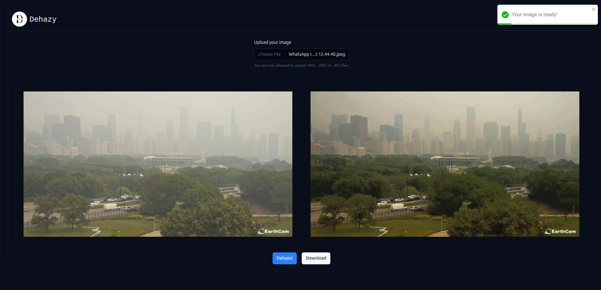

# U-Net Based Image Dehazer

This project demonstrates an image dehazing method using a U-Net-based deep learning model. The aim is to restore clear images from hazy inputs using convolutional neural networks.

## About the Project

- The notebook contains the complete workflow for training and testing a U-Net model on hazy images.
- U-Net is a widely used architecture for image-to-image tasks and is well-suited for restoring image clarity.
- The notebook is intended for demonstration and academic purposes.

## What’s Included

- Preprocessing of image data
- U-Net model definition using PyTorch
- Training loop to minimize image reconstruction loss
- Visualization of dehazed outputs alongside hazy inputs

## Notes

- The project is implemented entirely inside a Jupyter Notebook (`unet_image_dehazer.ipynb`).
- It is meant for reference only. There is no separate script or dataset upload included.
- The model was trained on paired examples of hazy and clear images.

## Applications

This project can be useful for:
- Understanding how U-Net can be used beyond segmentation tasks
- Exploring deep learning methods for image enhancement
- Educational demonstrations of image-to-image translation

  ## Output :
  

## Credits

Developed as part of an academic project. Inspired by the U-Net architecture introduced in "U-Net: Convolutional Networks for Biomedical Image Segmentation" (Ronneberger et al., 2015).
